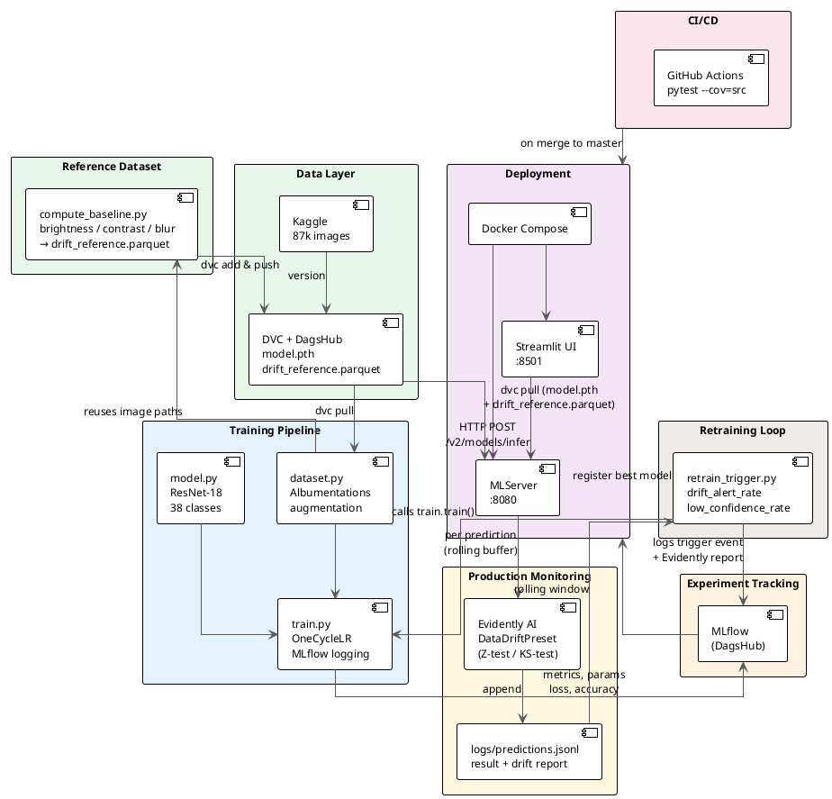

# Agritech Plant Health Classifier


## Project Objectives
The primary goal of this project is to implement a complete **end-to-end MLOps system**, integrating advanced technologies to manage the entire lifecycle of a Machine Learning model.

We developed a plant health classifier designed to help farmers and agricultural engineers identify plant diseases early. The system analyzes leaf images and classifies them as "Healthy" or suffering from a specific pathology (e.g., *Apple Scab* or *Tomato Early Blight*), covering a total of **38 classes**.

---

## Supported Plant Species & Diseases
Our model is trained on the [**New Plant Diseases Dataset**](https://www.kaggle.com/datasets/vipoooool/new-plant-diseases-dataset), allowing for the identification of health issues across various species:

* **Apple**: Scab, Black rot, Cedar apple rust, Healthy.
* **Blueberry**: Healthy.
* **Cherry**: Powdery mildew, Healthy.
* **Corn**: Cercospora leaf spot, Common rust, Northern Leaf Blight, Healthy.
* **Grape**: Black rot, Esca (Black Measles), Leaf blight (Isariopsis Leaf Spot), Healthy.
* **Orange**: Haunglongbing (Citrus greening).
* **Peach**: Bacterial spot, Healthy.
* **Pepper (Bell)**: Bacterial spot, Healthy.
* **Potato**: Early blight, Late blight, Healthy.
* **Raspberry**: Healthy.
* **Soybean**: Healthy.
* **Squash**: Powdery mildew.
* **Strawberry**: Leaf scorch, Healthy.
* **Tomato**: Bacterial spot, Early blight, Late blight, Leaf Mold, Septoria leaf spot, Spider mites, Target Spot, Yellow Leaf Curl Virus, Mosaic virus, Healthy.

---

## Tech Stack
Based on the methodologies learned during the course, the project utilizes the following tools:

| Domain | Tools & Frameworks |
| :--- | :--- |
| **Data Versioning & Augmentation** | DVC, DagsHub, Albumentations |
| **Experiment Tracking & Tuning** | MLflow, OneCycleLR Scheduler |
| **Model Training & Framework** | PyTorch |
| **Production Monitoring** | Evidently AI |
| **Testing & CI/CD** | pytest, GitHub Actions |
| **Deployment & UI** | Docker, MLServer, Streamlit |

---

## Repository Architecture
The project follows a modular structure to ensure scalability and separation of responsibilities:

* **`src/`**: Core of the system, including training, model definitions, runtime logic and monitoring.
* **`ui/`**: Independent user interface based on Streamlit.
* **`configs/`**: Centralized parameter management via `params.yml`.
* **`data/`**: Management of **87,000 images** (~2GB) via DVC metadata.
* **`models/`**: DVC-tracked artifacts
* **`logs/`**: Runtime-generated rolling log of predictions and drift reports.
* **`tests/`**: Automated test suite to ensure production stability.

---

## System Architecture

The diagram below shows the full MLOps lifecycle — from raw data through training, deployment, drift detection, and back via automated retraining.



> **Render tip:** paste the block above into [PlantUML Online](https://www.plantuml.com/plantuml/uml/) or use the VS Code PlantUML extension.

---

## Setup

### Download Data and Model
The dataset ("New Plant Diseases Dataset" from Kaggle), model weights and drift reference are managed via DVC to keep the Git repository lightweight:
```bash
pip install dvc
dvc pull
```

### Execution with Docker
The system utilizes containerization to ensure "run anywhere" consistency and easy deployment across different environments. By using Docker Compose, you can orchestrate both the inference engine and the user interface simultaneously.

* **MLServer**: Provides high-performance REST endpoints for real-time plant diagnosis.
* **Streamlit**: Offers a simple and intuitive web interface for uploading leaf photos from any device, providing specific disease classification and confidence scores instantly.

To build and run the services:
```bash
docker compose up --build
```

### (Re-)Build the Drift Reference Dataset

Run this once after training data is available, or whenever the training distribution changes:

```bash
python src/monitoring/compute_baseline.py
dvc add models/drift_reference.parquet
dvc push
```

All parameters are controlled via `configs/params.yml`.

---

## Drift Detection & Post-Production Retraining

### How It Works

Every inference request is evaluated for image quality drift. `runtime.py` feeds the raw image through `EvidentlyDriftDetector`, which maintains a rolling buffer of recent feature vectors and runs Evidently's `DataDriftPreset` (Z-test / KS-test per column) against the training reference dataset. The result is appended to `logs/predictions.jsonl`.

Three image features are tracked against the training-set reference:

| Feature | Measurement | Catches |
| :--- | :--- | :--- |
| **Brightness** | Mean pixel value | Seasonal lighting changes |
| **Contrast** | Pixel std deviation | Overexposed / washed-out images |
| **Blur** | Laplacian variance | Out-of-focus or low-resolution cameras |

### Triggering Retraining

`retrain_trigger.py` evaluates the rolling window of recent predictions and fires if either threshold is exceeded:

```bash
# Inspect metrics without retraining
python src/monitoring/retrain_trigger.py --dry-run

# Live run — triggers train.train() if thresholds exceeded
python src/monitoring/retrain_trigger.py
```

When triggered, it:
1. Calls `train.train()` directly
2. Logs the trigger reason, drift rate, and low-confidence rate to MLflow.
3. Uploads the last Evidently drift report as `evidently_drift_report.json` — visible on DagsHub alongside the retrain run.

---

## Quality Assurance & CI/CD

* **Automated Testing**: pytest validates preprocessing logic, model output shapes, API response formats, and Evidently drift detection behaviour.
* **Continuous Integration**: GitHub Actions runs the full test suite on every push and pull request to `master`.
* **Experiment Tracking**: MLflow logs metrics (accuracy, loss, learning rate), hyperparameters, and retraining trigger events for every run on DagsHub.
* **Training Optimization**: OneCycleLR scheduler for efficient convergence.
* **Data Augmentation**: Albumentations pipeline (horizontal flip, brightness/contrast, rotation, normalization) for robust generalization across field conditions.

---

## Useful Links
* [**GitHub Repository**](https://github.com/lorenzodifolco/agritech)
* [**DagsHub Project**](https://dagshub.com/lorenzodifolco00/agritech): Used for DVC remote storage and MLflow experiment tracking.

---

## System Demo
Watch the **Agritech Plant Health Classifier** in action. The video demonstrates the seamless upload process and the near-instant disease diagnosis.


---

## Team Members (Group 12)
This project was developed by Group 12 for the **Machine Learning and Data in Operation** course:
* **Gianluca Nogara**
* **Lorenzo Di Folco**
* **Kevin Hänggi**
* **Kai Erdin**
